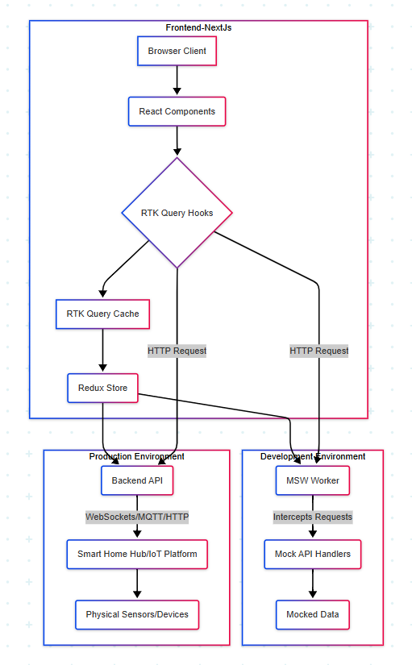
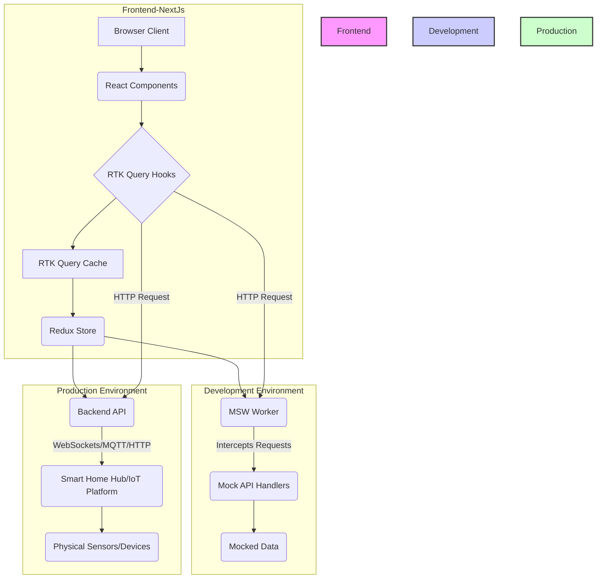

# Frontend System Design: Smart Home Dashboard

- **Application:** Smart Home Dashboard
- **Framework:** Next.js (App Router)
- **State Management & Data Fetching:** RTK Query
- **UI Components:** Shadcn UI (Tailwind CSS based)
- **Data Mocking:** Mock Service Worker (MSW)
- **Real-time Tracking:** HTTP Polling (RTK Query `pollingInterval`)

## To skip to setup instructions, click [here](#getting-started).

## 1. Core Requirements Recap

- Display 4 sensor values: Temperature, Humidity, Energy Usage, Door Lock Status.
- Real-time tracking (updates at a defined interval).
- Mocked data for local development using MSW.
- Clean, modern UI using Shadcn.
- Scalable data fetching with RTK Query.

## 2. Overview





**Explanation**:

- **Next.js Frontend**: This is our primary application running in the user's browser.
- **React Components**: These are our UI elements, building up the dashboard.
- **RTK Query Hooks**: Components use these hooks (useGetSensorDataQuery) to request data.
- **RTK Query Cache**: RTK Query automatically caches fetched data, improving performance and reducing redundant requests.
- **Redux Store**: The central state manager, where RTK Query integrates its API slice and cache.
- **MSW (Development)**: When running locally with mocking enabled, MSW intercepts the HTTP requests made by RTK Query (or Workspace directly) and serves mock data from local handlers. The requests never leave the browser.

--in actual production--

- **Backend API (Production)**: In production, RTK Query's Workspace requests go to a real backend API.
- **Smart Home Hub/IoT Platform**: This backend (Node.js, Python, AWS IoT, Home Assistant, etc.) acts as the bridge between your physical sensors/devices and your web application. For true real-time (push), it would likely use Web Sockets or MQTT.
- **Physical Sensors/Devices**: The actual smart home hardware.

---

## 3. Key Components & Logic

### 3.1. Data Types

Define the shape of your sensor data, including types for individual sensor values and the overall smart home data object. Also, include an interface for the generic API response.

### 3.2. RTK Query API Definition (`sensorApi.ts`)

This file will define your RTK Query API service using `createApi`.

- It sets a `reducerPath` (a unique name for this API slice in your Redux store).
- It defines a `baseQuery` which specifies the base URL for your API requests.
- Crucially, it defines an `endpoint` for fetching smart home data (`/api/sensors/data`).
- The **`pollingInterval`** is set to `3000` milliseconds (3 seconds) for the `getSensors` query. This is the core of your real-time tracking, ensuring data automatically refreshes every minute.
- RTK Query will automatically generate React hooks (e.g., `useGetSensorsQuery`) from these endpoints for use in your components.

### 3.3. Redux Store Setup (`store.ts`)

This file configures your main Redux store.

- It imports your `sensorApi` and includes its `reducer` in the store.
- It adds `sensorApi.middleware` to the Redux middleware chain, which enables RTK Query's caching, invalidation, polling, and other features.
- `setupListeners` is called to enable features like `refetchOnFocus` and `refetchOnReconnect`.
- Optional TypeScript types for `RootState` and `AppDispatch` are inferred from the store.

### 3.4. Root Layout for Provider (`layout.tsx`)

This is the top-level layout file for your Next.js application (in the App Router).

- It imports the `ReduxProvider` from `react-redux` and wraps your entire application's children with it, making the Redux store accessible to all components.
- It includes a conditional block to **start the MSW worker** (`msw/browser`) only in the browser environment. This ensures mocking is active during development.

### 3.5. Dashboard Page (`page.tsx`)

This will serve as your main dashboard page.

- Being a **Server Component** by default, it will handle initial page rendering.
- A `Suspense` boundary can be used to show a loading fallback while the client component loads.

### 3.6. Client Component Wrapper (`SensorPanel.tsx`)

This component will be a **Client Component** (marked with `'use client'`) and will contain the actual data fetching and display logic.

- It utilizes the `useGetSensorsQuery` hook to fetch sensor data.
- It handles loading states (`isLoading`) and error states (`error`), displaying appropriate messages.
- Once data is available (`data`), it renders individual `Tile` components, passing the relevant data.
- The `pollingInterval` defined in `sensorApi.ts` will automatically cause this component to re-render with fresh data every minute.

### 3.7. Individual Sensor Display (`Tile.tsx`)

A reusable **Client Component** that uses Shadcn UI's `Card` component to display each sensor's data.

- It accepts props like `title`, `subtitle`, `type`, `data`, and `children`.
- It formats the value and timestamp for the graph.
- It uses Shadcn's `Card` component to create a visually appealing tile for each sensor.

---

## 4. Mock Service Worker (MSW) Setup

MSW is vital for developing without a live backend.

### 4.1. Mock Handlers (`handlers.ts`)

This file defines the interception rules for your API requests.

- It uses `msw`'s `http.get` function to intercept requests to your defined API endpoint (e.g., `http://localhost:3000/api/sensors/latest`).
- It provides a mock JSON response for `SmartHomeData`, simulating dynamic changes to sensor values (e.g., random temperature, humidity, energy, and door lock status changes).
- The mock data updates each time the endpoint is hit, simulating real-time variations.

---

## 5. Development Workflow

1. **Install Dependencies:** Install Next.js, React, Redux Toolkit, React Redux, Tailwind CSS, MSW, and relevant TypeScript types.
2. **Initialize Shadcn UI:** Set up Shadcn UI and add the necessary components like `Card`, `Sonner`, etc.
3. **Generate MSW Worker:** Use the `msw init` command to set up the service worker file in your `public/` directory.
4. **Run Development Server:** Start your Next.js application using `npm run dev`.
5. **Observe:** Your dashboard should now load mocked data and automatically update every minute, thanks to RTK Query's `pollingInterval` and MSW seamlessly intercepting the requests.

---

## 6. Future Enhancement / Production Considerations

- **Real-time Push (Production):** For truly instantaneous updates, transition from HTTP polling to WebSockets or Server-Sent Events (SSE) on your backend. RTK Query can integrate with these using custom `baseQuery` or `onCacheEntryAdded` lifecycles.
- **Authentication/Authorization:** Implement user login and secure access to sensor data.
- **Control Panel:** Add UI elements (buttons, toggles) to send commands back to smart home devices (e.g., toggle door lock). This would involve RTK Query `mutations`.
- **Backend Integration:** Replace the MSW handlers with actual API calls to your live backend or IoT platform in production.

## Getting Started

First, run the development server:

```bash
npm run dev
```

Open [http://localhost:3000](http://localhost:3000) with your browser to see the result.
